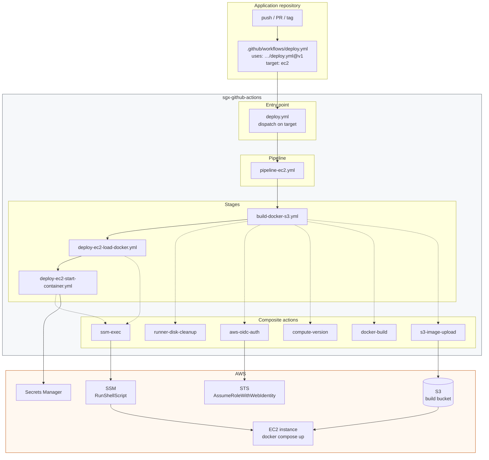
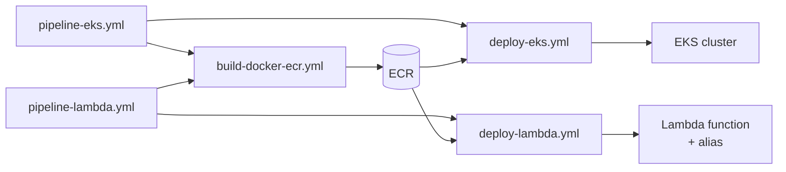

# Architecture

## The problem this repository solves

Without a central pipeline repository, every application repository grows its own
copy of "build a Docker image, push it somewhere, restart something in AWS".
Those copies drift. A fix to the OIDC session name, a new region, a hardened
`docker save` invocation — each has to be applied by hand in a dozen places, and
in practice it gets applied in three.

This repository holds one copy of each step. Application repositories declare
*what* they want deployed; this repository decides *how*.

## Four layers

```
Layer 4   Entry points     deploy, publish
          (dispatch)       One argument selects the path. What an app repo calls.
                                        |
                                        v
Layer 3   Pipelines        pipeline-ec2, pipeline-eks, pipeline-lambda, pipeline-static
          (orchestration)  Chain stages together for one target.
                                        |
                                        v
Layer 2   Stages           ci-*, build-*, publish-*, deploy-*, rollback-*
          (reusable        One job each. Own their GitHub environment,
           workflows)      permissions and approval gates.
                                        |
                                        v
Layer 1   Steps            actions/aws-oidc-auth, actions/ssm-exec, actions/docker-build,
          (composite       actions/setup-node, actions/compute-version, ...
           actions)        One task each. No environment, no secrets context.
```

The rule that keeps the layers from collapsing into each other:

- **A composite action never knows what environment it is running in.** It takes
  a region, not a branch name. It takes a role ARN, not a secret name. This is
  what makes `actions/ssm-exec` usable from a deploy workflow and a rollback
  workflow without either one special-casing the other.
- **A stage owns exactly one GitHub environment.** That is where approval rules,
  environment variables and environment secrets attach. A stage is the unit that
  can be gated.
- **A pipeline contains no logic of its own.** If a pipeline grows a `run:` step,
  that logic belongs in a stage or an action.
- **An entry point decides nothing except which pipeline runs.** It validates
  arguments, resolves a mode from the trigger, and dispatches.

## Why the entry points look repetitive

A consumer writes one job:

```yaml
uses: …/deploy.yml@v1
with:
  target: eks
```

The obvious implementation is not available:

```yaml
# Does not work. `uses` is resolved before any expression is evaluated.
uses: ./.github/workflows/pipeline-${{ inputs.target }}.yml
```

`jobs.<id>.uses` must be a static literal. GitHub reads it while building the
run graph, before `inputs` exists. So the dispatch is four statically declared
jobs, each gated on `if: inputs.target == '…'`, and three of them are skipped on
every run.

That is why the entry points are long and the consumer files are short. The
verbosity is paid once, here, instead of in every application repository.

The same constraint drives two details that otherwise look odd:

- **Target jobs depend on all three CI jobs.** Only one ever runs, so the guard
  is `if: !cancelled() && !failure() && …`. Any status function replaces the
  implied `success()` check, which is what stops the two skipped CI jobs from
  skipping the deployment with them — while a CI job that genuinely failed still
  blocks it.
- **A skipped job's outputs are empty strings, not errors.** That is what makes
  `${{ jobs.ec2.outputs.version || jobs.eks.outputs.version }}` work as a way to
  collect the output of whichever branch ran.

## The nesting ceiling

GitHub connects at most four levels of workflows, and the consumer's own file is
the first. Adding the entry point layer spends the last one:

```
consumer  ->  deploy.yml  ->  pipeline-ec2.yml  ->  build-docker-s3.yml
   1             2                  3                      4
```

Two consequences, both enforced by `scripts/check-nesting-depth.py` in CI:

- Nothing new can be inserted below an entry point.
- A consumer must call `deploy.yml` from a normal workflow. Wrapping it in
  another reusable workflow makes five levels and fails at runtime, in *their*
  repository. Repositories that need to wrap should call the `pipeline-*`
  workflow directly, which leaves a level spare.

## Full flow, EC2 path



No inbound port is opened on the instance. The runner never holds an AWS key:
`aws-oidc-auth` exchanges the GitHub OIDC token for short-lived STS credentials,
and every instance-side command travels as an SSM document.

## Registry path

For EKS, Lambda and anything else that pulls images natively, the S3 tarball hop
disappears:



`build-docker-ecr.yml` emits `image_uri` and `image_digest`; the deploy stage
consumes whichever the caller prefers. The tarball path exists only because the
EC2 fleet pulls from S3 over SSM rather than authenticating to a registry.

## Separating generic from technology-specific

The split is by *what varies*, not by *what the code is about*.

| Concern | Varies by | Lives in |
| --- | --- | --- |
| Assume a role, pick a region | nothing | `actions/aws-oidc-auth` |
| Run a command on an instance | nothing | `actions/ssm-exec` |
| Build an image | nothing (Dockerfile carries the difference) | `actions/docker-build` |
| Install a toolchain, restore deps | language | `actions/setup-node`, `setup-python`, `setup-java` |
| Lint, test, build | language | `ci-node.yml`, `ci-python.yml`, `ci-java.yml` |
| Publish a package | package format | `publish-npm.yml`, `publish-pypi.yml`, `publish-maven.yml` |
| Ship to a target | AWS service | `deploy-ec2-*`, `deploy-eks.yml`, `deploy-lambda.yml`, `deploy-s3-cloudfront.yml` |

Angular, React, NestJS and Nx do **not** get their own workflows. They differ in
which npm script to run, which is an input, not a workflow. `ci-node.yml` takes a
`framework` input purely to pick defaults — an Angular caller gets
`--watch=false --browsers=ChromeHeadless` on its test command without asking. Nx
is the one real branch, because `nx affected` needs git history and a base ref
that the others do not.

Adding Go or .NET later means one `setup-go` action and one `ci-go.yml`. It does
not mean touching the deploy layer, because the deploy layer has never known what
language produced the image.

## Organising deployment by AWS service

One stage per service, each owning that service's rollout semantics and its
matching rollback:

| Service | Deploy | Rollback | Rollback mechanism |
| --- | --- | --- | --- |
| EC2 | `deploy-ec2-load-docker.yml` + `deploy-ec2-start-container.yml` | `rollback-ec2.yml` | Reload an archived S3 tarball by version |
| EKS | `deploy-eks.yml` | `rollback-eks.yml` | `kubectl rollout undo`, or pin an explicit image |
| Lambda | `deploy-lambda.yml` | `rollback-lambda.yml` | Repoint the alias at an earlier published version |
| S3 + CloudFront | `deploy-s3-cloudfront.yml` | redeploy a previous commit | Sync plus invalidation |

Rollback is designed in, not bolted on. `build-docker-s3.yml` writes an immutable
`<version>.tar.gz` next to the moving `latest.tar.gz` specifically so
`rollback-ec2.yml` has something to return to. `deploy-lambda.yml` records the
alias's previous target *before* it changes anything, so the value survives a
failed deployment.

## Why internal references are fully qualified

A reusable workflow calling another reusable workflow in the same repository uses
a relative path:

```yaml
uses: ./.github/workflows/build-docker-s3.yml
```

A reusable workflow calling a composite action in the same repository cannot:

```yaml
# WRONG — `./` resolves against the *consumer's* checked-out repository
uses: ./actions/aws-oidc-auth

# RIGHT
uses: Ennovative-Genix/sgx-github-actions/actions/aws-oidc-auth@main
```

Job-level `uses:` is resolved by GitHub against the repository that owns the
workflow file. Step-level `uses: ./…` is resolved against the runner's workspace,
which holds the *calling* repository. This asymmetry is the single most common
source of "works in this repo, breaks for consumers".

The cost is that the ref is baked in. `scripts/check-internal-refs.sh` enforces
that all 48 of them agree, and `scripts/pin-internal-refs.sh` rewrites them when
cutting a new major line. See [conventions.md](conventions.md#versioning).

## Related documents

- [conventions.md](conventions.md) — naming, branching, versioning
- [contracts.md](contracts.md) — inputs, outputs, secrets, permissions
- [decision-matrix.md](decision-matrix.md) — reusable workflow vs composite vs JavaScript action
- [onboarding.md](onboarding.md) — adding a new application repository
- [pitfalls.md](pitfalls.md) — anti-patterns to avoid
