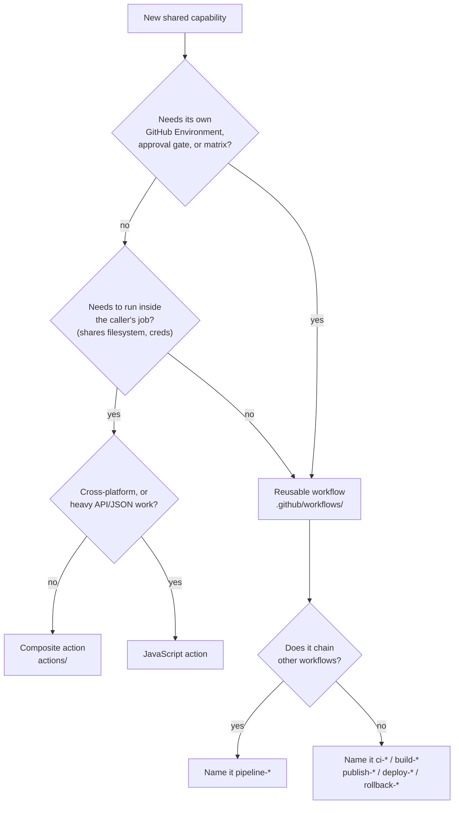

# Reusable workflow, composite action, or JavaScript action?

## The short version

| | Reusable workflow | Composite action | JavaScript action |
| --- | --- | --- | --- |
| Unit of reuse | One or more **jobs** | A sequence of **steps** | A single **step** |
| Called from | `jobs.<id>.uses` | `steps[].uses` | `steps[].uses` |
| Own runner | Yes, its own | No, the caller's | No, the caller's |
| Can set `runs-on` | Yes | No | No |
| Can set `environment` | Yes | **No** | No |
| Can use `secrets.*` | Yes | **No** — inputs only | No — inputs only |
| Can use `strategy.matrix` | Yes | No | No |
| Can run jobs in parallel | Yes | No | No |
| Can set job-level `permissions` | Yes | No | No |
| Returns values | Workflow outputs | Step outputs | Step outputs |
| Nesting limit | 4 levels | 10 levels | n/a |
| Startup cost | New runner, fresh checkout | None | Node startup, ~1s |
| Needs a build step | No | No | Yes (bundle `node_modules`) |
| Runs on Windows/macOS runners | Yes | Yes, if the shell exists | Yes, natively |

## Choosing

**Reusable workflow** when the unit of work needs its own runner, its own
environment, or its own approval gate.

The `environment:` row is usually the deciding one. A GitHub Environment is what
carries required reviewers, deployment branch policies, environment secrets and
environment variables — and only a job can declare one. Anything that must be
gated before it touches production has to be a workflow.

Also reach for a workflow when you want a matrix (`ci-node.yml` builds across
several Node versions), when stages should run in parallel, or when a stage
should be independently re-runnable from the Actions UI.

**Composite action** when the unit of work is a sequence of steps that belongs
*inside* someone else's job.

`actions/aws-oidc-auth` is the clearest case: it resolves a region, assumes a
role and records the caller identity — three steps that eleven different jobs
need, none of which want a separate runner for it. Making it a workflow would
mean a new runner, a fresh checkout, and credentials that the calling job cannot
see anyway, because credentials do not cross the job boundary.

`actions/runner-disk-cleanup` is the case that proves the rule. Making it a
reusable workflow — a `needs:` dependency that runs before the build — looks
reasonable and does nothing at all: each job gets a fresh runner, so it would
free disk on a machine the build never touches. Cleanup only works as a step
inside the job that is short on space, which means it has to be an action.

**JavaScript action** when you genuinely need to call the GitHub API, parse
something structured, or run identical logic across Linux, Windows and macOS
runners.

This repository currently has none, on purpose. A JavaScript action needs a
`package.json`, a bundler, committed `dist/` output, and a release process that
keeps the bundle in sync with the source. That is real maintenance cost, and
`jq`, `aws` and `gh` are already on every GitHub-hosted runner. Reach for one
when the alternative is genuinely worse — for example, paginating the GitHub API
and reconciling results, which is miserable in bash and trivial in JavaScript.

## Decision flow

## Traps worth knowing before you choose

**Composite actions cannot see `secrets`.** There is no `secrets` context inside
`action.yml`. Every secret arrives as an input, which means it also appears in the
caller's YAML. Pass the value, and let the caller be the one holding
`${{ secrets.IAM_ROLE_ARN }}`.

**Composite action inputs are always strings.** `boolean` is not a valid input
type in `action.yml`. `if: inputs.push` is truthy for the *string* `"false"`, so
comparisons must be explicit — `if: inputs.push == 'true'` — and callers must
pass `"true"` / `"false"` as quoted strings. Every action in this repository
documents its boolean inputs as strings for this reason.

**Reusable workflows cost a runner each.** Three chained stages means three
runner starts and three checkouts. `pipeline-ec2.yml` accepts that cost because
each stage is independently gated and independently re-runnable; a single job of
equivalent steps would be faster and strictly worse to operate.

**`uses: ./…` means different things at different levels.** At job level it
resolves against the repository owning the workflow. At step level it resolves
against the runner workspace, which holds the *consumer's* code. Composite
actions in this repository are therefore always referenced as
`Ennovative-Genix/sgx-github-actions/actions/<name>@<ref>`.

**Reusable workflows nest four deep, and pipelines already use two.**
`pipeline-eks.yml` → `build-docker-ecr.yml` is two. A consumer wrapping a pipeline
in their own reusable workflow makes three. There is room, but not unlimited
room.
